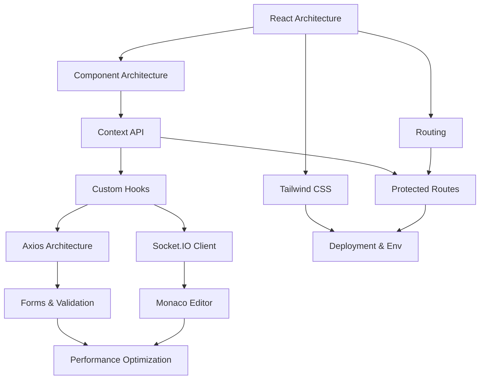

# MockMate Frontend Interview Preparation Index

Welcome to the frontend interview study guide and question bank index. This guide is structured to help you review, study, and confidently defend every major frontend engineering decision made in this project.

## Study roadmap & Dependency Graph

To optimize your study path, it is recommended to review topics in order of their dependencies. The graph below displays which architectural foundations should be studied first:

---

## Study Guide Links

Each link below redirects to a dedicated topic guide containing implementation details, code flows, key study concepts, and a comprehensive bank of interview questions (no answers provided, designed for active recall).

### React Architecture & Core Components
- [React Architecture](react-architecture.md) — React 19 bootstrap pipelines, SPA rendering layouts, and page trees.
- [Component Architecture](component-architecture.md) — Pages vs child widgets, component composition, reuse of forms, and Framer Motion setups.
- [Tailwind CSS](tailwind.md) — Tailwind CSS v4 compiler configurations, responsive classes, CSS variables, and light/dark theme switches.

### States, Routing & Protection
- [Context API](context-api.md) — AuthContext and SocketContext setups, in-memory state management, and pub/sub token store subscriptions.
- [Custom Hooks](custom-hooks.md) — useAuth, useSocket, and useDebounce custom React hooks.
- [Routing](routing.md) — React Router Dom v7, route configurations, useParams matching, and background locations overlays.
- [Protected Routes](protected-routes.md) — Route guards, loading buffers, unverified gates, and redirect behaviors.

### Network, Editor & Real-Time Sync
- [Axios Architecture](axios.md) — Axios instances, authorization headers, request interceptors, and response queueings for token refreshes.
- [Socket.IO Client](socket-client.md) — Connection handshake arguments, heartbeat intervals, listener bindings, and listener cleanups.
- [Monaco Editor](monaco-editor.md) — Monaco React initialization, resize layouts, language selector integration, and C++ driver wrapper builders.
- [Forms & Validation](forms-validation.md) — Controlled states, submit preventions, error banners, regex checks, and date ranges.

### Performance & Deployment
- [Performance Optimization](performance.md) — React renders profiles, input debouncers, layout cleanups, and browser paint limits.
- [Deployment & Environment Variables](deployment-env.md) — Vite compiler tools, vercel.json rewrite rules, VITE_ variable prefixes, and assets builds.

---

## Study Strategy
1. **Follow the Roadmap**: Start with **React Architecture**, then move to **Component Architecture** and **Tailwind CSS** before diving into specialized network or editor workspaces.
2. **Active Recall**: Answer the questions inside the "Questions About MY Implementation" sections out loud or write down your answers before inspecting the codebase.
3. **Practice Debugging**: Walk through the "Debugging Questions" in each file and verify you can pinpoint the files and lines that would cause the described anomalies.
4. **Solve Coding Exercises**: Attempt to build mock implementations of the practical exercises described in each document.
